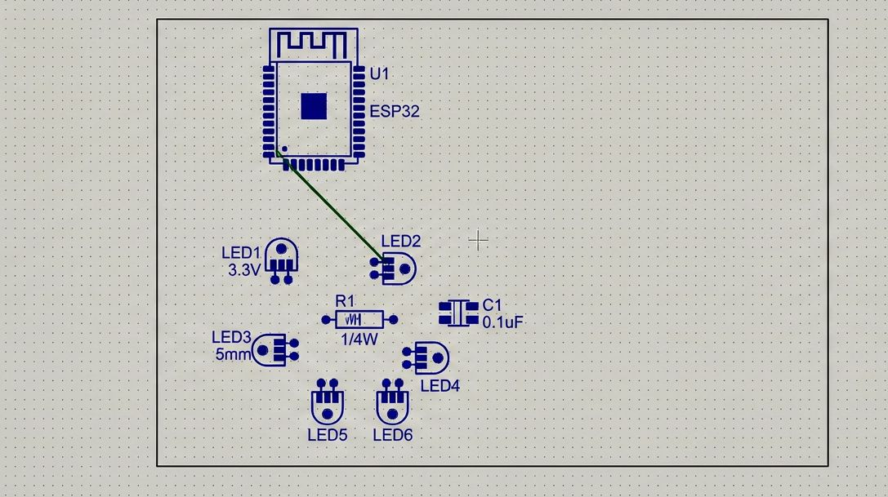

# MoodCanvas

This is a project where I'm building a 256 LED art display that reacts to things in the room like temperature or sound. The idea is to make something chill and nice to look at, not just rainbow flashing lights. I'm designing a PCB for the LEDs and building a wood/epoxy frame so it looks good on a desk or wall.

I haven't really done PCB design or woodworking before so I'm just figuring it out as I go. I'm using an ESP32 and a few sensors to drive animations.

## Progress

- made a rough PCB layout in KiCad
- testing LED animations on ESP32
- sketched enclosure ideas
- trying to understand power stuff for a lot of LEDs
- 
This is my first PCB layout test with the ESP32 and a few LEDs. I'm experimenting with spacing, footprints, and basic routing before scaling up to a larger LED matrix.

I'll upload more photos/screenshots later. For now here's a screenshot (work in progress):



## Repo Structure

```
 moodcanvas/
│
├── firmware/                     # ESP32 firmware code
│
├── hardware/                     # Custom PCB design (KiCad)
│
├── cad/                          # Enclosure models & sketches
│
├── images/                       # Build photos + screenshots
│
├── tools/                        # Side tools & experiments
│   └── thermo-mood-cube-web-sim/ # Web simulator
│
├── docs/                         # Build notes, logs, etc
│
└── README.md

```

## Old web sim thing

Before building the hardware version I made a small web app to test color transitions. It wasn’t meant to be a final thing, just a way to play around with ideas. I put it in the tools folder because it’s not part of the main build.

## Stuff I'm trying to learn

- pcb design
- sensors
- animations
- esp32 programming
- wood + epoxy

## Next steps

- clean up PCB routing
- build enclosure
- write animation code based on sensor input
- put everything together

## Why I'm doing this

I wanted to build something that feels alive and looks cool in a room, and also learn some new skills at the same time.

## Notes

Repo is going to be messy while I'm building. I’ll add more pictures and updates as I go.
